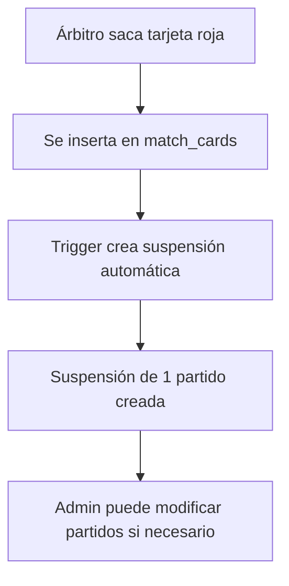
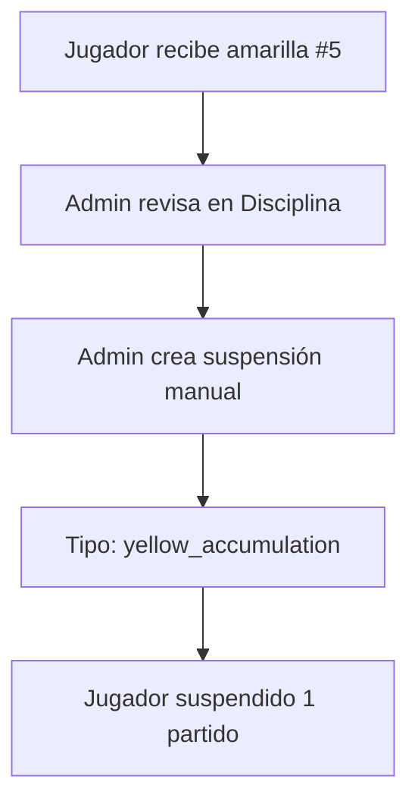
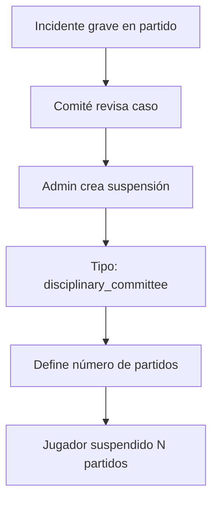

# Sistema de Suspensiones de Jugadores

Este documento describe el sistema completo de gestión de suspensiones para jugadores en Zona-Gol.

## Características Principales

### 1. **Suspensiones Automáticas**
- **Tarjeta Roja Directa**: Se crea automáticamente una suspensión de 1 partido cuando un jugador recibe tarjeta roja
- El trigger `trigger_create_suspension_for_red_card` se ejecuta al insertar una tarjeta roja en `match_cards`

### 2. **Suspensiones Manuales**
Los administradores de liga pueden crear suspensiones por:
- Acumulación de tarjetas amarillas (configurable, por defecto 5)
- Decisiones del comité disciplinario
- Otras razones administrativas

### 3. **Tipos de Suspensión**
```typescript
type suspension_type =
  | 'red_card'              // Tarjeta roja directa
  | 'yellow_accumulation'   // Acumulación de amarillas
  | 'disciplinary_committee'// Comité disciplinario
  | 'other'                 // Otras razones
```

### 4. **Estados de Suspensión**
```typescript
type suspension_status =
  | 'active'      // Suspensión activa (en curso)
  | 'completed'   // Suspensión cumplida
  | 'cancelled'   // Suspensión cancelada por admin
```

## Tablas de Base de Datos

### `player_suspensions`
Tabla principal que registra todas las suspensiones:

```sql
CREATE TABLE player_suspensions (
  id UUID PRIMARY KEY,
  player_id UUID NOT NULL,
  team_id UUID NOT NULL,
  league_id UUID NOT NULL,
  tournament_id UUID,

  suspension_type suspension_type NOT NULL,
  reason TEXT NOT NULL,
  matches_to_serve INTEGER NOT NULL DEFAULT 1,
  matches_served INTEGER NOT NULL DEFAULT 0,
  status suspension_status NOT NULL DEFAULT 'active',

  match_card_id UUID,  -- Si fue por tarjeta
  match_id UUID,       -- Partido donde ocurrió

  created_by UUID,
  updated_by UUID,
  notes TEXT,
  start_date TIMESTAMP,
  end_date TIMESTAMP,

  created_at TIMESTAMP,
  updated_at TIMESTAMP
)
```

### `suspension_match_applications`
Tabla que registra en qué partidos se aplicó cada suspensión:

```sql
CREATE TABLE suspension_match_applications (
  id UUID PRIMARY KEY,
  suspension_id UUID NOT NULL,
  match_id UUID NOT NULL,
  applied_at TIMESTAMP,

  UNIQUE(suspension_id, match_id)
)
```

## Funciones de Base de Datos

### 1. `create_suspension_for_red_card()`
**Automática** - Se ejecuta cuando se inserta una tarjeta roja:
```sql
-- Crea automáticamente una suspensión de 1 partido
-- Se dispara con el trigger después de INSERT en match_cards
```

### 2. `check_yellow_card_accumulation()`
**Manual** - Se debe llamar desde la aplicación:
```sql
SELECT check_yellow_card_accumulation(
  p_player_id := 'uuid-del-jugador',
  p_league_id := 'uuid-de-la-liga',
  p_tournament_id := 'uuid-del-torneo', -- opcional
  p_yellow_limit := 5  -- por defecto 5
);
```

Retorna:
- `TRUE` si se creó una nueva suspensión
- `FALSE` si no se alcanzó el límite o ya existe una suspensión activa

### 3. `is_player_suspended()`
**Consulta** - Verifica si un jugador está suspendido para un partido:
```sql
SELECT is_player_suspended(
  p_player_id := 'uuid-del-jugador',
  p_match_id := 'uuid-del-partido'
);
```

Retorna:
- `TRUE` si el jugador tiene suspensiones activas pendientes
- `FALSE` si el jugador puede jugar

## Flujos de Trabajo

### Flujo 1: Tarjeta Roja Directa



### Flujo 2: Acumulación de Amarillas



### Flujo 3: Comité Disciplinario



## Interfaz de Usuario

### Pestaña "Disciplina" (Tabla de Tarjetas)
Muestra:
- Lista de todos los jugadores con tarjetas
- Contador de amarillas y rojas por jugador
- **Estado de suspensión** (nuevo)
- Badge "SUSPENDIDO" si el jugador está inhabilitado
- Fondo rojo en las filas de jugadores suspendidos

### Pestaña "Suspensiones" (Gestión)
Permite:
- **Ver todas las suspensiones** (activas, completadas, canceladas)
- **Crear nuevas suspensiones** manualmente
- **Completar suspensiones** cuando se cumplen
- **Cancelar suspensiones** si hay error o decisión administrativa

Formulario de nueva suspensión:
```typescript
{
  player_id: UUID,           // Selección de jugador
  suspension_type: string,   // Tipo de suspensión
  reason: string,            // Motivo detallado
  matches_to_serve: number,  // Número de partidos
}
```

## Reglas de Negocio

### 1. Suspensión Automática por Roja
- ✅ Se crea automáticamente al insertar tarjeta roja
- ✅ Suspensión por defecto: 1 partido
- ✅ Admin puede modificar el número de partidos después

### 2. Acumulación de Amarillas
- ⚠️ NO se crea automáticamente (requiere acción del admin)
- ✅ Se puede configurar el límite (por defecto 5)
- ✅ Solo se crea una suspensión por acumulación a la vez

### 3. Aplicación de Suspensiones
- 🔄 **Pendiente de implementación**: Sistema para marcar automáticamente partidos cumplidos
- 📝 Por ahora, el admin debe completar manualmente las suspensiones

### 4. Verificación de Elegibilidad
- 🔄 **Pendiente de implementación**: Validación al escanear QR
- 📝 Función `is_player_suspended()` lista para usar
- 🎯 Se puede integrar en el flujo de asistencia QR

## Próximas Mejoras Sugeridas

### 1. Validación en Escaneo QR
```typescript
// En la app Flutter, al escanear QR:
const isSuspended = await supabase
  .rpc('is_player_suspended', {
    p_player_id: playerId,
    p_match_id: matchId
  })

if (isSuspended) {
  showError('⛔ Jugador suspendido - No puede participar')
  return
}
```

### 2. Auto-cumplimiento de Suspensiones
Crear un trigger o función que:
- Cuando se finaliza un partido
- Busca suspensiones activas de jugadores de los equipos
- Incrementa `matches_served`
- Si `matches_served >= matches_to_serve`, marca como `completed`

### 3. Notificaciones
- Email/Push al jugador cuando es suspendido
- Recordatorio al propietario del equipo
- Notificación cuando se cumple la suspensión

### 4. Historial y Estadísticas
- Panel con historial de suspensiones por jugador
- Estadísticas de disciplina por equipo
- Rankings de jugadores más disciplinados/indisciplinados

### 5. Calendario de Suspensiones
- Vista de calendario mostrando qué jugadores están suspendidos por jornada
- Planificación de planteles considerando suspensiones

## Políticas de Seguridad (RLS)

### Lectura
- ✅ Super admins: Todas las suspensiones
- ✅ League admins: Suspensiones de su liga
- ✅ Team owners: Suspensiones de jugadores de su equipo

### Escritura
- ✅ League admins: Pueden crear, modificar y cancelar suspensiones de su liga
- ❌ Team owners: Solo lectura
- ❌ Jugadores: Solo lectura (si tienen acceso)

## Ejemplo de Uso

### Crear suspensión manual desde el dashboard:

1. Admin va a **Suspensiones** → **Nueva Suspensión**
2. Selecciona jugador: "Juan Pérez (#10) - Barcelona"
3. Tipo: "Comité Disciplinario"
4. Motivo: "Agresión a rival en partido vs Real Madrid"
5. Partidos: 3
6. **Crear Suspensión**

Resultado:
- ✅ Suspensión creada con status `active`
- ✅ Jugador aparece como "SUSPENDIDO" en tabla de disciplina
- ✅ No podrá jugar los próximos 3 partidos de Barcelona
- 🔄 Admin puede completar manualmente después de 3 partidos

### Verificar si un jugador puede jugar:

```sql
-- ¿Puede Juan Pérez jugar el próximo partido?
SELECT is_player_suspended(
  'id-de-juan-perez',
  'id-del-proximo-partido'
);
-- Retorna: true (suspendido) o false (puede jugar)
```

## Migración

Para aplicar este sistema a tu base de datos:

```bash
# Ejecutar la migración
psql -h tu-host -U tu-usuario -d tu-database \
  -f supabase/migrations/20251001000001_create_player_suspensions.sql
```

O desde Supabase Dashboard:
1. SQL Editor
2. Pegar contenido del archivo de migración
3. Ejecutar

## Soporte

Para preguntas o problemas:
- Revisar logs de Supabase para errores de triggers
- Verificar políticas RLS si hay problemas de permisos
- Consultar esta documentación para flujos de trabajo
